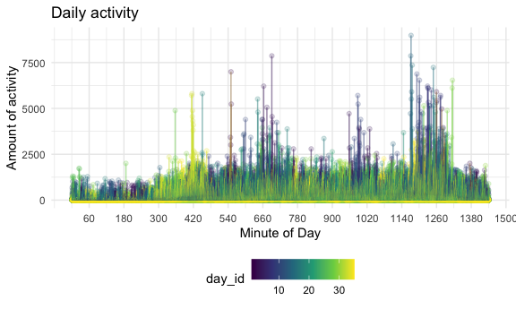

Homework 3
================
Emily Bamforth
10 October 2020

``` r
library(tidyverse)
```

    ## ── Attaching packages ───────────────── tidyverse 1.3.0 ──

    ## ✓ ggplot2 3.3.2     ✓ purrr   0.3.4
    ## ✓ tibble  3.0.3     ✓ dplyr   1.0.2
    ## ✓ tidyr   1.1.2     ✓ stringr 1.4.0
    ## ✓ readr   1.3.1     ✓ forcats 0.5.0

    ## ── Conflicts ──────────────────── tidyverse_conflicts() ──
    ## x dplyr::filter() masks stats::filter()
    ## x dplyr::lag()    masks stats::lag()

``` r
library(p8105.datasets)

knitr::opts_chunk$set(
  fig.width = 6,
  fig.asp = .6,
  out.width = "90%"
)

theme_set(theme_minimal() + theme(legend.position = "bottom"))

options(
  ggplot2.continuous.colour = "viridis",
  ggplot2.continuous.fill = "viridis"
)

scale_colour_discrete = scale_colour_viridis_d
scale_fill_discrete = scale_fill_viridis_d
```

# Problem 1

Load in the data.

``` r
data("instacart")
```

This dataset has 1384617 rows and 15 columns.

Each observation in the dataset is based on the `order_id`. There are 15
variables in this dataset, which tell us about the order, the user, and
the items, including `order_id`, `user_id`, `product_name`, and
`order_hour_of_day`. Location of items are provided by department, aisle
and item name.

Information about aisles: how many are there, and from which aisles are
the most items purchased?

``` r
instacart %>% 
  count(aisle) %>% 
  arrange(desc(n))
```

    ## # A tibble: 134 x 2
    ##    aisle                              n
    ##    <chr>                          <int>
    ##  1 fresh vegetables              150609
    ##  2 fresh fruits                  150473
    ##  3 packaged vegetables fruits     78493
    ##  4 yogurt                         55240
    ##  5 packaged cheese                41699
    ##  6 water seltzer sparkling water  36617
    ##  7 milk                           32644
    ##  8 chips pretzels                 31269
    ##  9 soy lactosefree                26240
    ## 10 bread                          23635
    ## # … with 124 more rows

There are 134 aisles in this dataset. The most items are purchased from
the `fresh vegetables` aisle (150609 items) and the `fresh fruits` aisle
(150473 items).

Here’s a plot about these aisles:

``` r
instacart %>% 
  count(aisle) %>% 
  filter(n > 10000) %>% 
  mutate(
    aisle = factor(aisle),
    aisle = fct_reorder(aisle, n)
  ) %>% 
  ggplot(aes(x = aisle, y = n)) + 
  geom_point() +
  theme(axis.text.x = element_text(angle = 90, vjust = 0.5, hjust = 1))
```


A table about popular items:

``` r
instacart %>% 
  filter(aisle %in% c("baking ingredients", "dog food care", "packaged vegetables fruits")) %>% 
  group_by(aisle) %>% 
  count(product_name) %>% 
  mutate(rank = min_rank(desc(n))) %>% 
  filter(rank < 4) %>% 
  arrange(aisle, rank) %>% 
  knitr::kable()
```

| aisle                      | product\_name                                 |    n | rank |
| :------------------------- | :-------------------------------------------- | ---: | ---: |
| baking ingredients         | Light Brown Sugar                             |  499 |    1 |
| baking ingredients         | Pure Baking Soda                              |  387 |    2 |
| baking ingredients         | Cane Sugar                                    |  336 |    3 |
| dog food care              | Snack Sticks Chicken & Rice Recipe Dog Treats |   30 |    1 |
| dog food care              | Organix Chicken & Brown Rice Recipe           |   28 |    2 |
| dog food care              | Small Dog Biscuits                            |   26 |    3 |
| packaged vegetables fruits | Organic Baby Spinach                          | 9784 |    1 |
| packaged vegetables fruits | Organic Raspberries                           | 5546 |    2 |
| packaged vegetables fruits | Organic Blueberries                           | 4966 |    3 |

And a table about the mean hour of each day of the week when Pink Lady
Apples and Coffee Ice Cream are ordered:

``` r
instacart %>% 
  filter(product_name %in% c("Pink Lady Apples", "Coffee Ice Cream")) %>% 
  group_by(product_name, order_dow) %>% 
  summarize(mean_hour = mean(order_hour_of_day)) %>% 
pivot_wider(
  names_from = order_dow,
  values_from = mean_hour) %>% 
  knitr::kable()
```

    ## `summarise()` regrouping output by 'product_name' (override with `.groups` argument)

| product\_name    |        0 |        1 |        2 |        3 |        4 |        5 |        6 |
| :--------------- | -------: | -------: | -------: | -------: | -------: | -------: | -------: |
| Coffee Ice Cream | 13.77419 | 14.31579 | 15.38095 | 15.31818 | 15.21739 | 12.26316 | 13.83333 |
| Pink Lady Apples | 13.44118 | 11.36000 | 11.70213 | 14.25000 | 11.55172 | 12.78431 | 11.93750 |

## Problem 2

First, read the data.

``` r
accel_df =
  read_csv("data/accel_data.csv")
```

    ## Parsed with column specification:
    ## cols(
    ##   .default = col_double(),
    ##   day = col_character()
    ## )

    ## See spec(...) for full column specifications.

Let’s tidy the data.

``` r
accel_tidy_df =
  pivot_longer(
    accel_df,
    activity.1:activity.1440,
    names_to = "minute_of_day",
    values_to = "activity_amount"
  ) %>% 
  mutate(minute_of_day = gsub('activity.', '', minute_of_day)) %>%
  mutate(minute_of_day = as.numeric(minute_of_day)) %>% 
  mutate(day = as.factor(day),
         day = forcats::fct_relevel(day, c("Monday", "Tuesday", "Wednesday", "Thursday", "Friday", "Saturday", "Sunday"))
  ) %>% 
  mutate(weekend_weekday = 
           case_when(
             day %in% c("Monday","Tuesday","Wednesday","Thursday","Friday") ~ "weekday",
             day %in% c("Saturday","Sunday") ~ "weekend"
           )
  )
```

This dataset consists of data from an accelerometer, tracking the
activity of a 63-year-old male who was diagnosed with congestive heart
failure. The dataset has 50400 rows and 6 columns. We can see the
`activity_amount` for each `minute_of_day` across a five-week period.
Each observation is a minute during this time frame, and there are 50400
such observations. Other variables include the `week` number (out of 5
weeks), the `day` of the week, and a variable that tells us whether the
activity took place on the weekend or weekday.

Total activity per day:

``` r
activity_day_df =
  accel_tidy_df %>% 
  group_by(day_id) %>% 
  summarize(activity_day = sum(activity_amount))
```

    ## `summarise()` ungrouping output (override with `.groups` argument)

``` r
knitr::kable(activity_day_df)
```

| day\_id | activity\_day |
| ------: | ------------: |
|       1 |     480542.62 |
|       2 |      78828.07 |
|       3 |     376254.00 |
|       4 |     631105.00 |
|       5 |     355923.64 |
|       6 |     307094.24 |
|       7 |     340115.01 |
|       8 |     568839.00 |
|       9 |     295431.00 |
|      10 |     607175.00 |
|      11 |     422018.00 |
|      12 |     474048.00 |
|      13 |     423245.00 |
|      14 |     440962.00 |
|      15 |     467420.00 |
|      16 |     685910.00 |
|      17 |     382928.00 |
|      18 |     467052.00 |
|      19 |     371230.00 |
|      20 |     381507.00 |
|      21 |     468869.00 |
|      22 |     154049.00 |
|      23 |     409450.00 |
|      24 |       1440.00 |
|      25 |     260617.00 |
|      26 |     340291.00 |
|      27 |     319568.00 |
|      28 |     434460.00 |
|      29 |     620860.00 |
|      30 |     389080.00 |
|      31 |       1440.00 |
|      32 |     138421.00 |
|      33 |     549658.00 |
|      34 |     367824.00 |
|      35 |     445366.00 |

From simply viewing this table, we can see there are a few days when
this patient is slightly more or less active, but their daily activity
amount is generally within the range of 300000 to 600000.

Let’s plot activity over the course of a day (for all 35 days):

``` r
accel_tidy_df %>%
  ggplot(aes(x = minute_of_day, y = activity_amount, color = day_id)) +
  geom_point(alpha = .2) +
  geom_line(alpha = .3) +
  labs(
    title = "Daily activity",
    x = "Minute of Day",
    y = "Amount of activity"
  ) +
  scale_x_continuous(
    breaks = c(60, 180, 300, 420, 540, 660, 780, 900, 1020, 1140, 1260, 1380, 1500),
    labels = c(60, 180, 300, 420, 540, 660, 780, 900, 1020, 1140, 1260, 1380, 1500)
  )
```



Based on this graph, which shows the activity over the course of the day
(for all 35 days), we can see some trends pertaining to how active this
patient generally is at different times of the day. Activity tends to be
lower late at night and very early in the day, though it doesn’t appear
he is incredibly active most days during the day. It does appear the
patient has a few small bursts of energey during the day, notably around
7:30pm-9:30pm at night.

# Problem 3
